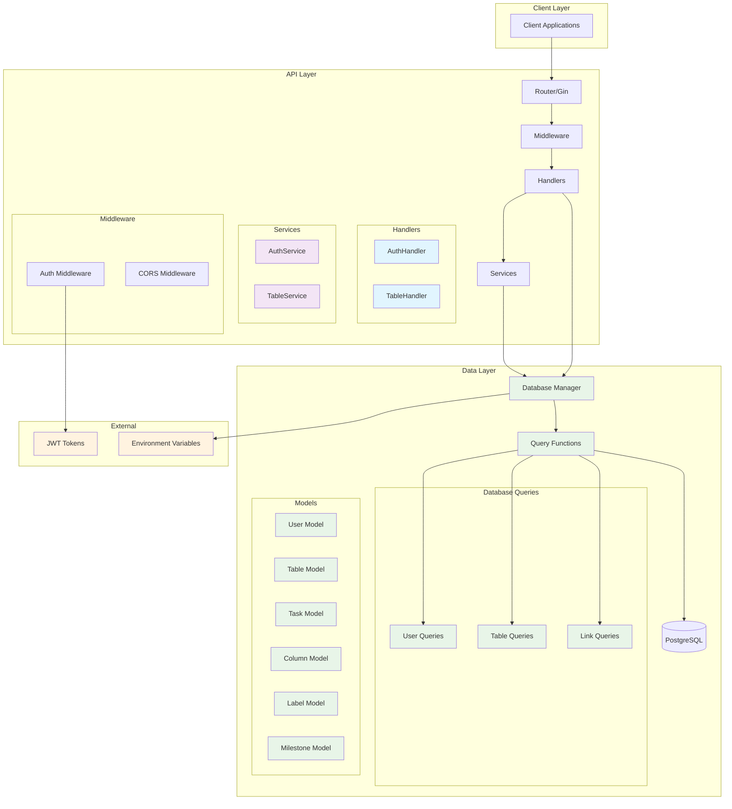
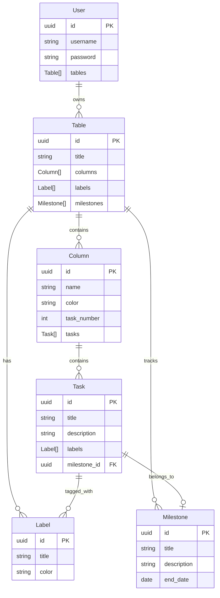

# Korrast API

A REST API for the Korrast project management application built with Go, Gin, and PostgreSQL. 

## 🏗️ Architecture Overview



## 📁 Project Structure

```
api/
├── main.go                # Application entry point
├── Dockerfile             # Container configuration
├── docker-compose.yaml    # Service orchestration
├── go.mod                 # Go module dependencies
├── 
├── api/                   # Legacy API handlers (to be refactored)
├── dto/                   # Data Transfer Objects
├── handler/               # HTTP request handlers
├── service/               # Business logic layer
├── middleware/            # HTTP middleware (auth, CORS, etc.)
├── database/              # Database connection and queries
├── model/                 # Data models
├── request/               # Request parsing utilities
└── response/              # Response formatting utilities
```

## 🔧 API Endpoints

### Authentication
- `POST /register` - Register a new user
- `POST /login` - Authenticate and get JWT token

### Tables (Protected)
- `POST /api/tables` - Create a new table
- `GET /api/tables` - Get all user tables

### Models Structure



## 🛠️ Setup & Installation

### Prerequisites
- Go 1.21+
- Docker & Docker Compose
- PostgreSQL (if running without Docker)

### Environment Variables

Create a `.env` file in the API directory:

```env
# Database Configuration
DB_HOST=localhost
DB_PORT=5432
DB_USER=korrast-dev
DB_PASSWORD=123456
DB_NAME=korrast_db

# JWT Configuration
SECRET_TOKEN=your-super-secret-jwt-key-change-this-in-production

# Optional: Enable stub mode for testing
# STUB_MODE=true
```

### Quick Start with Docker

1. **Start the entire stack:**
   ```bash
   docker-compose up -d
   ```

2. **Check service health:**
   ```bash
   docker-compose ps
   docker-compose logs korrast-api
   ```

3. **API will be available at:** `http://localhost:8080`

### Manual Setup

1. **Clone and setup:**
   ```bash
   git clone <repository>
   cd korrast/api
   go mod download
   ```

2. **Start PostgreSQL:**
   ```bash
   cd ../database
   docker-compose up -d
   ```

3. **Run the API:**
   ```bash
   cd ../api
   go run main.go
   ```

### Build Scripts

- **Linux/Mac:** `./build.sh`
- **Windows:** `build.bat`

## 🧪 Testing the API

### Register a new user
```bash
curl -X POST http://localhost:8080/register \
  -H "Content-Type: application/json" \
  -d '{"username": "testuser", "password": "password123"}'
```

### Login
```bash
curl -X POST http://localhost:8080/login \
  -H "Content-Type: application/json" \
  -d '{"username": "testuser", "password": "password123"}'
```

### Create a table (requires JWT token)
```bash
curl -X POST http://localhost:8080/api/tables \
  -H "Content-Type: application/json" \
  -H "Authorization: Bearer YOUR_JWT_TOKEN" \
  -d '{"title": "My Project"}'
```

### Create a column
```bash
curl -X POST http://localhost:8080/api/columns \
  -H "Content-Type: application/json" \
  -H "Athorization: Bearer YOUR_JWT_TOKEN" \
  -d '{"table_id": "table_id", "title": "New columns", `optinnal`: "color": "#FAE536"}' 
```

## 📄 License

MIT License - see LICENSE file for details.

## Author

This project is entirely made by me (ASTOLFI Vincent). I suggest you to check on my github profile if you want to see the other project I've done for my studies or the ones I do in my free time. 
